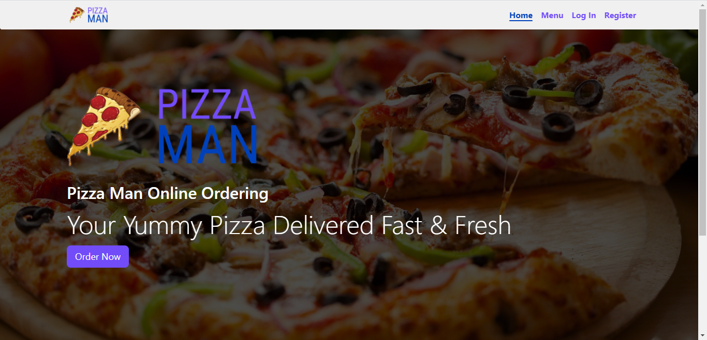
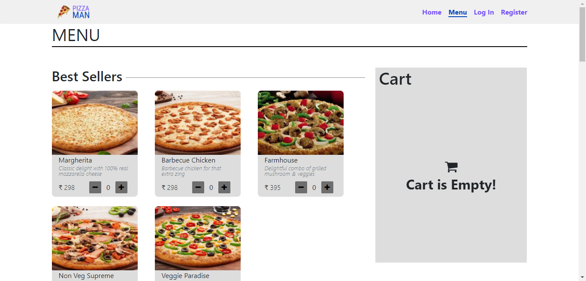
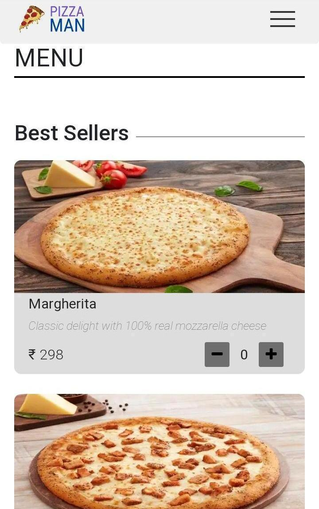
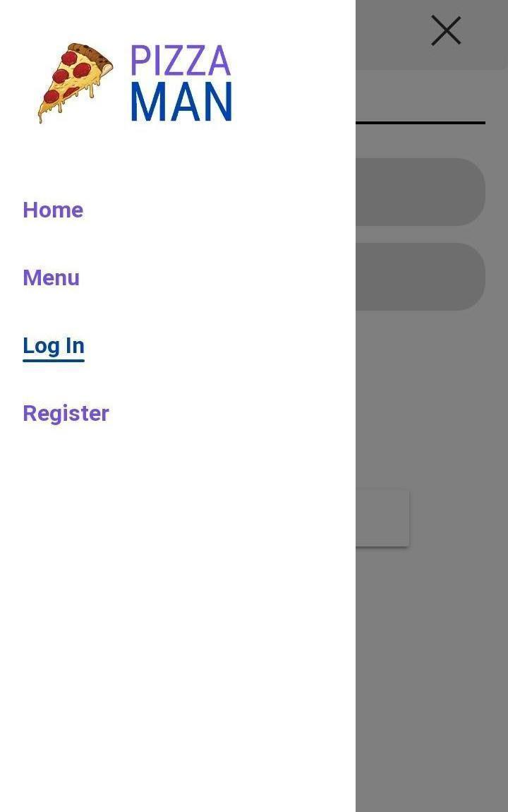

# Pizza Man Project

An E-Commerce website for ordering Pizza Online

## Tools used

1. React: To create the Single Page App
2. React-Router: For Routing
3. Redux: For State Management
4. Firebase: As a DataBase

## Firebase Setup

You need to create a firebase configeration file holding the firebase settings in the path `/src/firebase/config.js`. The required format is:

```javascript
const firebaseConfig = {
	apiKey: "API-KEY",
	authDomain: "AUTH-DOMAIN.firebaseapp.com",
	databaseURL: "DATABASE-URL.firebaseio.com",
	projectId: "PROJECT-ID",
	storageBucket: "STORAGE-BUCKET.appspot.com",
	messagingSenderId: "MESSAGING-SENDER-ID",
	appId: "APP-ID",
	measurementId: "MEASUREMENT-ID",
};

export default firebaseConfig;
```

Data needs to be stored in the following format:

```javascript
[
	{
		name: "CATEGORY NAME",
		items: [
			{
				desc: "PIZZA DESCRIPTION",
				id: "ID",
				img: "IMAGE LINK",
				name: "PIZZA NAME",
				price: 100, // PRICE
			},
		],
	},
];
```

An example data is given in `/src/firebase/exampleData.json`

## How to Use

To use the project follow the steps given below:

1. Install the necessary modules (`npm install`).
2. Setup Firebase Project and configuration
3. Use `npm start` to run the react app

## Screenshots

### Desktop

<p align="center">
  
</p>

<p align="center">
  
</p>

### Mobile

<p align="center">
  
</p>

<p align="center">
  
</p>

<p align="center">
  
</p>
